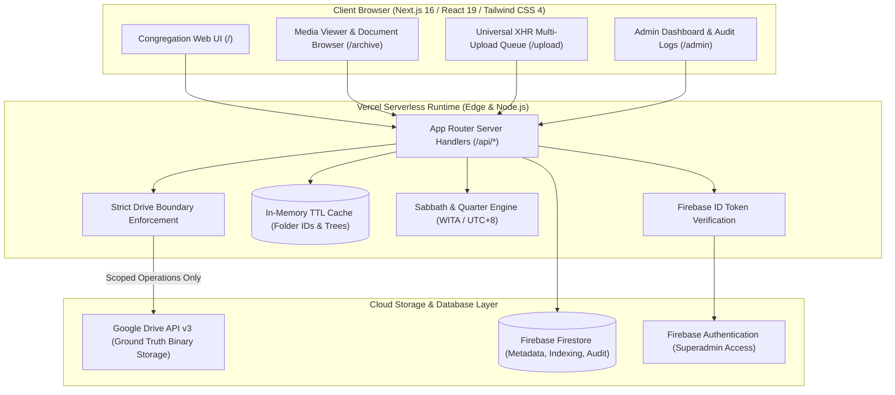

# GMAHK Galilea Digital Archive

> A secure, high-performance digital repository and media management archive built for the GMAHK Galilea congregation.

[](#)
[](https://github.com/zvenians/gmahk-galilea-digital-archive/actions/workflows/ci.yml)
[](https://drive-galilea.vercel.app)
[-black?style=flat-square&logo=nextdotjs)](https://nextjs.org/)
[](https://www.typescriptlang.org/)
[](https://developers.google.com/drive)
[](https://firebase.google.com/)

---

## 1. Project Overview

The **GMAHK Galilea Digital Archive** serves as the central visual and liturgical repository for church services. It ensures that weekly worship records, liturgy bulletins, choir audio, and ministry photos are permanently organized, easily accessible to congregation members, and strictly safeguarded against accidental deletion or unauthorized modifications.

---

## 2. Problem & Solution

### The Problem
In church administration and media ministries, weekly worship assets (bulletin PDFs, liturgy slides, sermon notes, event photos, and audio recordings) are commonly exchanged across unorganized messaging threads and personal flash drives. Over time:
* **Assets are lost or scattered:** Historical bulletins and liturgy files become impossible to find across different quarters and years.
* **Storage risk:** Granting multiple church volunteers direct administrative access to a shared Google Drive risks accidental deletion, out-of-boundary file movement, and exposure of personal account files.
* **Bandwidth & quota constraints:** Browsing deep cloud folder trees directly through public Drive links triggers heavy API quota consumption and poor mobile performance.

### The Solution
**GMAHK Galilea Digital Archive** provides a dedicated, high-performance web custody layer over Google Drive API v3 and Firebase Firestore:
1. **Strict Folder Boundary Enforcement:** All read, upload, and trash operations are cryptographically and programmatically bounded to designated church parent folders (`Dokumentasi` and `File Ibadah`). Personal or out-of-scope files on the connected Google account cannot be read or traversed.
2. **Dynamic Sabbath-Centric Navigation:** A custom timezone engine calculates weekly Sabbath dates (`Asia/Makassar` / WITA UTC+8), automatically creating and organizing folder structures by Year (`2026`), Quarter (`Triwulan I - IV`), and date (`12 September 2026`).
3. **Resilient Upload Queue:** Client-side XHR queue with genuine byte-level upload progress (`loaded / total`), concurrency limiting (max 3 concurrent uploads), duplicate name protection, and anti-page-unload guards.
4. **Serverless In-Memory Caching:** High-efficiency TTL caching layer reduces redundant Google Drive API roundtrips by up to 90%, ensuring lightning-fast folder navigation.

---

## 3. Architecture & Data Flow



---

## 4. Key Features

- **Dynamic Archive Tree Discovery:** Automatically reads and parses directory structures in Google Drive by Year (`2026`), Quarter (`Triwulan I - IV`), and Indonesian Sabbath dates (`12 September 2026`).
- **Sabbath Calculation Engine (WITA / UTC+8):** Automatically determines the active, nearest, and upcoming Sabbath dates in Makassar local time (`Asia/Makassar`), guaranteeing dynamic quarter navigation.
- **Universal Multi-File Upload:**
  - Client-side XHR queue with genuine byte-level progress reporting (`loaded / total`).
  - Strict concurrency control (maximum 3 concurrent active uploads).
  - Partial failure resilience with single-file and batch-level retry mechanisms.
  - Zero-byte file rejection and automatic duplicate filename collision prevention (`name (1).ext`).
  - Navigation protection (`beforeunload` & confirmation dialog) preventing queue loss during active uploads.
- **Format-Agnostic File Handling:** Accepts all valid binary formats supported by Google Drive (images, videos, PDFs, office documents, audio, archives, and spreadsheets) with universal download and sharing actions.
- **Homepage Showcase ("Momen Pelayanan"):** Displays randomized media exclusively sourced from the managed `Dokumentasi` archive without leaking any personal Drive files.
- **High-Performance In-Memory Caching:** Serverless-optimized TTL memory cache for folder discovery and archive trees, cutting Google Drive API calls by up to 90% and protecting quota limits.
- **Role-Based Access Control:**
  - **Viewer:** Public/congregation access to explore the archive, view previews, download files, and submit uploads.
  - **Admin:** Authenticated management dashboard with capability to move files to Google Drive trash, review activity logs, trigger metadata reconciliation, and view diagnostics.

---

## 5. Technology Stack

- **Framework:** [Next.js 16.3](https://nextjs.org/) (App Router, Turbopack)
- **Language:** [TypeScript 5](https://www.typescriptlang.org/)
- **UI & Styling:** [React 19](https://react.dev/), [Tailwind CSS 4](https://tailwindcss.com/), [Lucide React](https://lucide.dev/)
- **Storage & Cloud APIs:** [Googleapis](https://github.com/googleapis/google-api-nodejs-client) (Google Drive API v3 OAuth 2.0 Client)
- **Database & Auth:** [Firebase 12](https://firebase.google.com/) (Firestore Client & Auth), [Firebase Admin 14](https://firebase.google.com/docs/admin/setup)
- **Testing:** Node.js native test runner (`node:test`, `node:assert/strict`) with `tsx`

---

## 6. Project Structure

```
.
├── src/
│   ├── app/
│   │   ├── admin/             # Admin dashboard page
│   │   ├── api/
│   │   │   ├── admin/         # Admin endpoints (activities, logs, reconcile, trash)
│   │   │   ├── archive/       # Archive endpoints (tree, random, download)
│   │   │   ├── sabbath/       # Sabbath calculation API
│   │   │   └── upload/        # Multipart file upload handler
│   │   ├── archive/           # Archive viewer and gallery page
│   │   ├── login/             # Firebase Google login page
│   │   ├── upload/            # Upload queue page
│   │   ├── globals.css        # Tailwind CSS styles
│   │   ├── layout.tsx         # Root layout
│   │   └── page.tsx           # Homepage ("Setiap Sabat Menyimpan Cerita")
│   ├── components/
│   │   ├── Footer.tsx         # Global footer
│   │   ├── MediaViewer.tsx    # Fullscreen portal viewer (preview, download, share, delete)
│   │   └── Navbar.tsx         # Navigation bar with auth status
│   ├── context/
│   │   ├── AuthContext.tsx    # Firebase authentication state provider
│   │   └── ToastContext.tsx   # Global notification toast provider
│   └── lib/
│       ├── auth-server.ts     # Server-side Firebase token & role verification
│       ├── automation.ts      # Cloud automation triggers
│       ├── drive-bootstrap.ts # Google Drive initial directory bootstrapper
│       ├── drive.ts           # Google Drive client, in-memory cache, and folder operations
│       ├── firebase-admin.ts  # Firebase Admin SDK initialization
│       ├── firebase-client.ts # Firebase client-side SDK initialization
│       ├── firestore.ts       # Firestore document indexing and audit logging
│       ├── sabbath.ts         # WITA Sabbath and quarterly calendar engine
│       └── types.ts           # Core TypeScript data definitions
├── test/                      # Comprehensive unit and integration test suites
├── scripts/                   # OAuth setup and bootstrap scripts
└── public/                    # Static assets
```

---

## 7. Local Development

### Prerequisites

- Node.js 20+ (recommended 22 or 24)
- npm 10+
- Google Cloud Project with Google Drive API enabled
- Firebase Project with Authentication & Firestore enabled

### Installation

1. Clone the repository:
   ```bash
   git clone https://github.com/zvenians/gmahk-galilea-digital-archive.git
   cd gmahk-galilea-digital-archive
   ```

2. Install dependencies:
   ```bash
   npm install
   ```

3. Configure environment variables:
   ```bash
   cp .env.example .env.local
   ```
   Fill in your Google OAuth and Firebase credentials in `.env.local`.

4. Start the development server:
   ```bash
   npm run dev
   ```
   Open [http://localhost:3000](http://localhost:3000) in your browser.

---

## 8. Environment Variables

The application requires the following environment variables (defined in `.env.local` for local development or configured in Vercel project settings):

| Variable | Description | Exposure |
| :--- | :--- | :--- |
| `GOOGLE_CLIENT_ID` | Google OAuth 2.0 Web Client ID | Server-only |
| `GOOGLE_CLIENT_SECRET` | Google OAuth 2.0 Client Secret | Server-only |
| `GOOGLE_DRIVE_REFRESH_TOKEN` | OAuth Refresh Token with Drive access | Server-only |
| `GOOGLE_DRIVE_ROOT_FOLDER_ID` | Folder ID of "GMAHK Galilea" root | Server-only |
| `GOOGLE_DRIVE_DOKUMENTASI_FOLDER_ID` | Folder ID of "Dokumentasi" directory | Server-only |
| `GOOGLE_DRIVE_FILE_IBADAH_FOLDER_ID` | Folder ID of "File Ibadah" directory | Server-only |
| `NEXT_PUBLIC_FIREBASE_API_KEY` | Firebase Client API Key | Public (Client) |
| `NEXT_PUBLIC_FIREBASE_AUTH_DOMAIN` | Firebase Authentication Domain | Public (Client) |
| `NEXT_PUBLIC_FIREBASE_PROJECT_ID` | Firebase Project ID | Public (Client) |
| `NEXT_PUBLIC_FIREBASE_STORAGE_BUCKET` | Firebase Storage Bucket | Public (Client) |
| `NEXT_PUBLIC_FIREBASE_MESSAGING_SENDER_ID` | Firebase Messaging Sender ID | Public (Client) |
| `NEXT_PUBLIC_FIREBASE_APP_ID` | Firebase Application ID | Public (Client) |
| `SUPER_ADMIN_EMAIL` | Email address granted Super Admin privileges | Server-only |
| `NEXT_PUBLIC_SUPER_ADMIN_EMAIL` | Public reference for UI role checking | Public (Client) |

> **Note:** Never commit actual secrets or `.env.local` to version control.

---

## 9. Testing

The project includes an automated test suite verifying security boundaries, Sabbath calculations, error classifications, and Drive integration:

```bash
npm run test
```

To run lint checks:
```bash
npm run lint
```

---

## 10. Production Build

To test the production build locally:

```bash
npm run build
npm run start
```

---

## 11. Deployment

The project is configured for seamless deployment on [Vercel](https://vercel.com):

1. Connect the GitHub repository to your Vercel account.
2. Add all environment variables in **Project Settings -> Environment Variables**.
3. Deploy directly with:
   ```bash
   npx vercel --prod
   ```

---

## 12. Security Notes

- **Archive Boundary Enforcement:** All download, upload, and trash operations strictly validate that the target file resides within the managed `GMAHK Galilea` folder tree (`Dokumentasi` or `File Ibadah`). Personal files on the connected Google account are inaccessible.
- **Server-Side Authorization:** Admin endpoints (`/api/admin/*`) require cryptographically verified Firebase ID tokens and reject arbitrary client-side role headers.
- **Token Freshness:** Expired tokens are caught gracefully, preventing upload batches from silently failing without clear user notifications.
- **Zero Secret Exposure:** Server-side Google OAuth tokens, service accounts, and refresh tokens are strictly kept on the server side and never sent to the browser.

---

## 13. Additional Documentation

Detailed technical architecture and setup manuals are organized in the [`docs/`](./docs) directory:

- [Architecture Guide](./docs/ARCHITECTURE.md) - Deep dive into system design, authentication flow, and data pipelines.
- [Google Setup Guide](./docs/GOOGLE_SETUP.md) - Google Cloud Console OAuth 2.0 and Service Account configuration.
- [Project Handoff Manual](./docs/GMAHK_DIGITAL_ARCHIVE_HANDOFF.md) - Operational handoff and administration procedures.
- [Implementation Plan](./docs/IMPLEMENTATION_PLAN.md) - Development roadmap and architectural decisions.
- [Walkthrough](./docs/walkthrough.md) - Verification walkthrough and audit notes.

---

## 14. Development & CI Workflow

The repository employs automated continuous integration (CI) via GitHub Actions to maintain reliability:

```text
Local Branch ──► Pull Request ──► GitHub Actions CI (Lint, Test, Build) ──► Merge to main ──► Vercel Production
```

- **Local Verification:** Run `npm run lint`, `npm run test`, and `npm run build` before pushing.
- **Automated Gating:** Every push and pull request to `main` triggers automated verification executing ESLint 9, unit tests, and production build checks.
- **Production Delivery:** Merges to `main` automatically trigger continuous deployment on Vercel.


